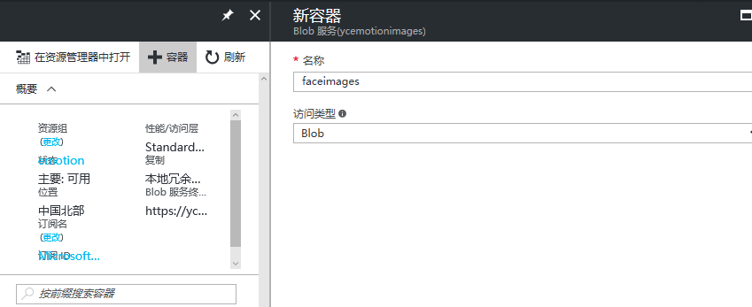
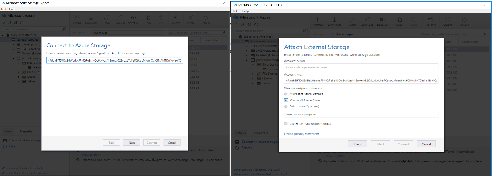
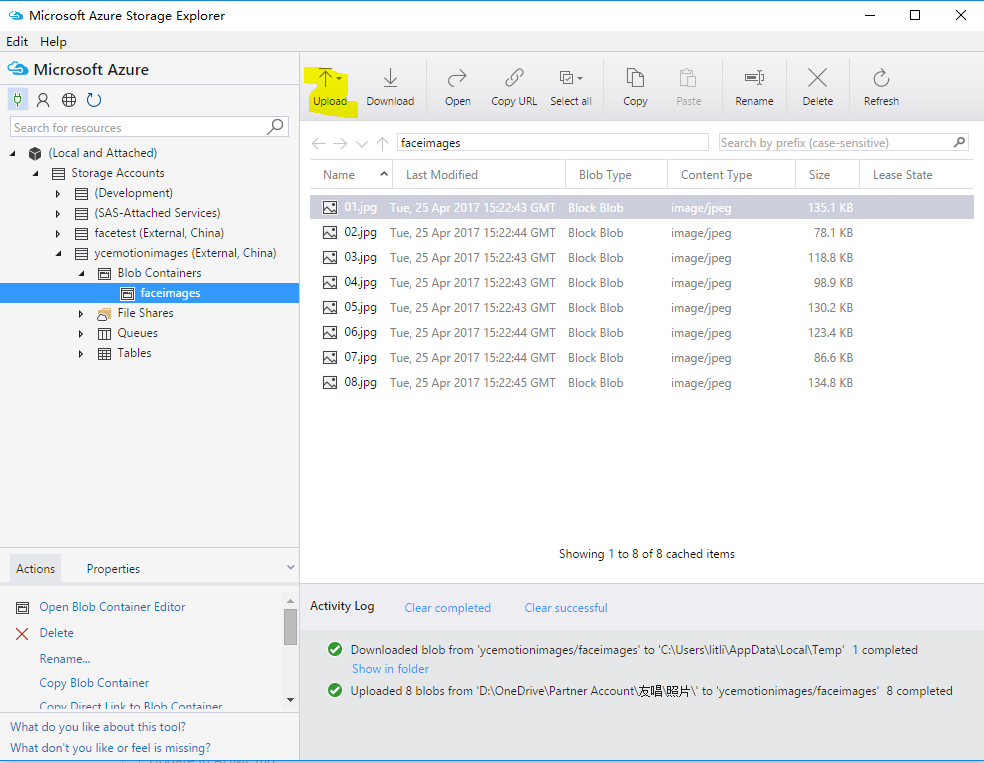
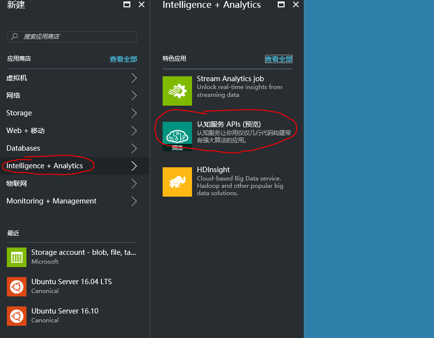
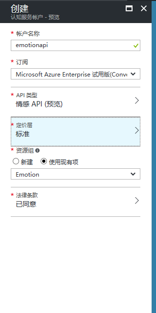
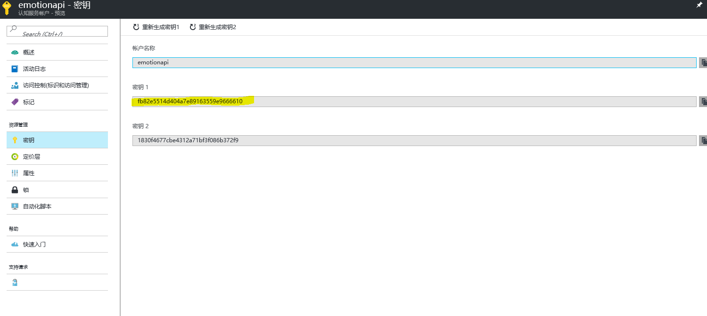

# YouChang（友唱） -EmotionProject
友唱Emotion Project是基于[微软认知服务表情API](https://www.microsoft.com/cognitive-services/en-us/emotion-api)的实现友唱用户情感识别的代码样例。该样例包括以下Azure服务：
- Azure Linux VM
- Azure Storage　
- Azure Cognitive Service: Emotion API
第三方的产品：
- [libcurl](https://curl.haxx.se/libcurl/c/libcurl.html)

该样例也可以作为在C语言环境下使用libcurl，实现调用微软认知服务REST API的样例。

## Emotion Project- 样例场景 ##

该样例业务场景是，使用微软认知服务的情感API，识别用户在唱歌过程中的情绪状态。具体技术架构如下：

*Figure 1. 友唱样例架构图*


## 部署1：Linux虚机和Curl环境部署 ##


* 使用Azure账号登陆[Azure管理门户](http://portal.azure.cn)，选择创建虚机，选择Ubuntu16模板，按需选择配置，设置用户名密码，创建。
* 使用Putty登陆创建的虚机，部署开发环境：
  1\.  Install Tools: 
 
  ```bash  sudo apt-get install g++ git autoconf libtool make
  ```
  2\. Deploy Curl:
  ```bash
  git clone https://github.com/curl/curl.git curl
  ./buildconf
  ./configure --with-ssl="$PREFIX"
  make
  ``` 
## 部署2：创建存储账户 ##
* 使用Azure账号登陆[Azure管理门户](http://portal.azure.cn)，选择创建存储账户，设置账号名称，选择类型为Blob存储，设置与虚机同一个资源组，如下图

*Figure 2. 创建存储账户*

创建成功后，进入存储账户设置中复制该账户访问密钥，后面配置Storage Explorer使用
* 在[Azure管理门户](http://portal.azure.cn)中，为存储账户创建blob container，如图命名为faceimages

*Figure 3. 创建blob container*


* 使用[Microsft Azure Storage Explorer](http://storageexplorer.com/)配置访问存储账户，如下图

*Figure 4. 配置Storage Explorer*


* 在 Microsoft Azure Storage Explorer中进入存储账户的blob container下面，上传用户照片

*Figure 5. 上传用户图片*



 
## 部署3：创建表情服务 ##
* 使用Azure账号登陆[Azure管理门户](http://portal.azure.cn)，选择智能+分析中的认知服务，设置服务名称和相关配置信息，具体可以参考下图

*Figure 6. 创建表情服务*



创建成功后，进入表情服务设置中复制该账户访问密钥，后面配置开发中使用

*Figure 7. 复制表情服务密钥*



## 部署4：Curl命令行和代码访问认知服务Rest API ##

微软中国Azure认知服务[表情Rest API](https://dev.cognitive.azure.cn/docs/services/5639d931ca73072154c1ce89/operations/563b31ea778daf121cc3a5fa)中， 对C语言的Rest API建议Curl实现， 这里我们分别给出命令行和libcurl代码两种访问方式的说明。

* 1 Curl命令行
```bash
curl -v -X POST "https://api.cognitive.azure.cn/emotion/v1.0/recognize" -H "Content-Type: application/json" -H "Ocp-Apim-Subscription-Key:fb82e5514d404a7e89163559e9666610"   --data-ascii "{\"url\": \"https://ycemotionimages.blob.core.chinacloudapi.cn/faceimages/06.jpg\"}"
```
运行结果如下，可以查看表情结果

(./YouChang13.PNG)
