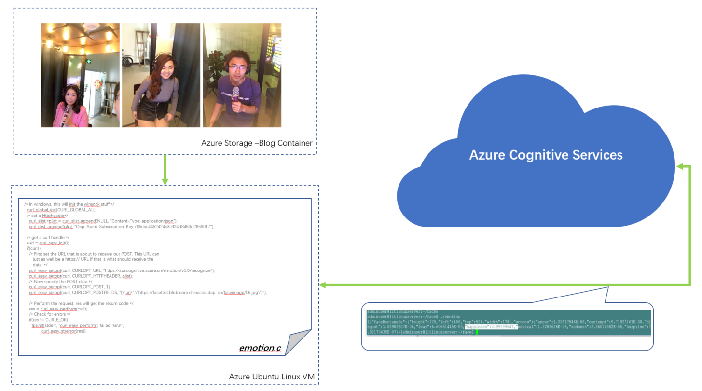
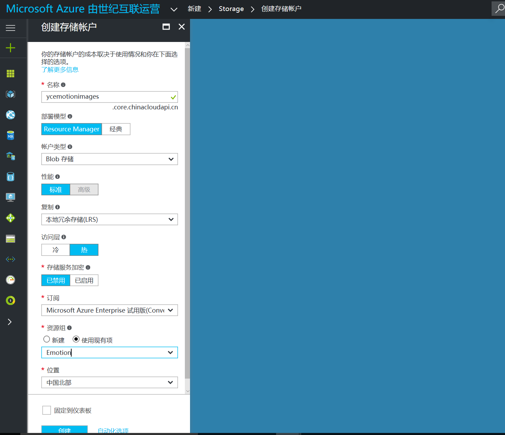

# YouChang（友唱） -EmotionProject

友唱Emotion Project是基于[微软认知服务表情API](https://www.microsoft.com/cognitive-services/en-us/emotion-api)的实现友唱用户情感识别的代码样例。该样例包括以下Azure服务：
- Azure Linux VM
- Azure Storage　
- Azure Cognitive Service: Emotion API
第三方的产品：
- [libcurl](https://curl.haxx.se/libcurl/c/libcurl.html)

该样例也可以作为在C语言环境下使用libcurl，实现调用微软认知服务REST API的样例。

## Emotion Project- 样例场景 ##

该样例业务场景是，使用微软认知服务的情感API，识别用户在唱歌过程中的情绪状态。具体技术架构如下：

*Figure 1. 友唱样例架构图*




## 部署1：Linux虚机和Curl环境部署 ##

* 使用Azure账号登陆Azure管理门户(http://portal.azure.cn)，选择创建虚机，选择Ubuntu16模板，按需选择配置，设置用户名密码，创建。
* 使用Putty登陆创建的虚机，部署开发环境：

  1\.  Install Tools: 
 
  ```bash
  sudo apt-get install g++ git 
  ```
  2\. Deploy Curl:
  ```bash
  git clone https://github.com/curl/curl.git curl
  ```
 
## 部署2：创建存储账户 ##
* 使用Azure账号登陆Azure管理门户(http://portal.azure.cn)，选择创建存储账户，设置账号名称，选择类型为Blob存储，设置与虚机同一个资源组，如下图

*Figure 2. 创建存储账户*

